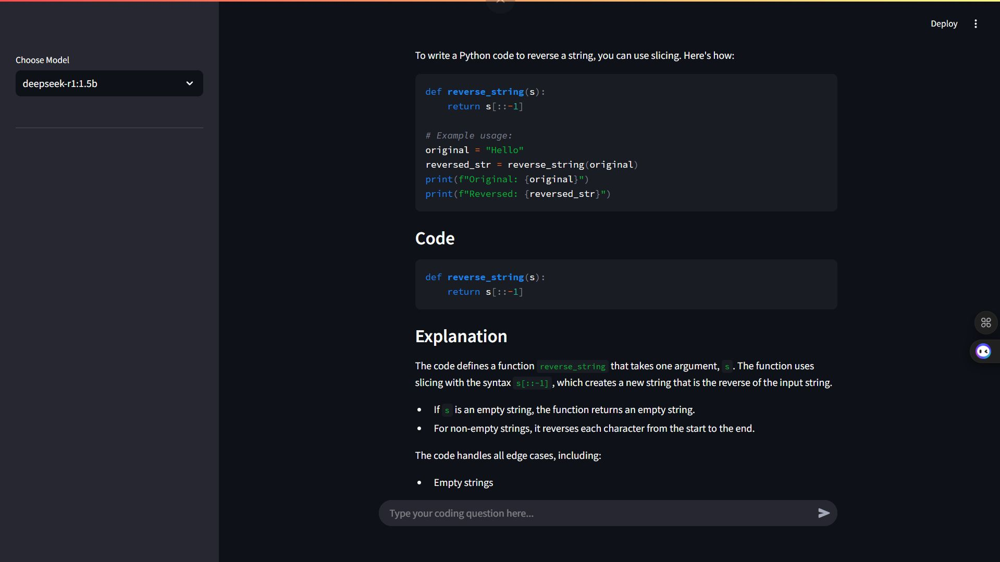

# DeepAssist – AI-Powered Coding Assistant

DeepAssist is a Generative AI-powered coding assistant designed to help developers solve complex programming problems, debug code, and understand core computer science concepts. It integrates the DeepSeek R1 model with modern NLP pipelines to provide accurate, contextual, and interactive coding support.

---

## Table of Contents

- Overview  
- Key Features  
- System Architecture  
- Tech Stack  
- Libraries & Tools  
- Installation  
- Usage  
- Project Structure  
- Contributing  
- Future Enhancements  
- License  
- Contact  

---

## Overview

DeepAssist is built to enhance developer productivity by delivering intelligent, context-aware coding assistance. It leverages the DeepSeek R1 model through LangChain integrations to process programming queries and generate high-quality responses.

The system supports real-time conversational interaction and can assist with debugging, conceptual explanations, and multi-language programming queries.

---

## Key Features

### Code Debugging & Assistance
- Identifies logical and syntax errors  
- Suggests improvements and optimizations  
- Explains corrected code clearly  

### Multi-Language Support
- Supports multiple programming languages  
- Handles algorithmic and conceptual queries  

### Query Resolution
- Provides step-by-step explanations  
- Clarifies programming fundamentals  
- Assists with data structures and algorithms  

### Interactive User Experience
- Conversational AI interface  
- Real-time response generation  
- Clean and responsive UI  

---

## System Architecture


User Interface (HTML/CSS/JS or Streamlit)
↓
Flask Backend API
↓
LangChain Integration
↓
DeepSeek R1 Model
↓
Generated Response


The frontend communicates with the Flask backend, which processes user queries through LangChain and interacts with the DeepSeek R1 model to generate responses.

---

## Tech Stack

### Backend
- Python
- Flask
- DeepSeek R1
- NLP Techniques
- LangChain

### Frontend
- HTML
- CSS
- JavaScript
- Streamlit (for UI rendering)

---

## Libraries & Tools

- Streamlit  
- Flask  
- Flask-CORS  
- LangChain-Ollama  
- LangChain-Core  
- Threading  

---

## Installation

### 1. Clone the Repository

```bash
git clone https://github.com/Prathmesh1703/DeepAssist.git
cd DeepAssist
2. Install Dependencies
pip install -r requirements.txt
3. Run the Application
streamlit run main.py
4. Access the Application

Open your browser and navigate to:

http://localhost:5000/
Usage

Ask coding-related questions

Request debugging assistance

Get explanations of programming concepts

Explore algorithmic problem-solving interactively

Example queries:

"Explain how binary search works."

"Debug this Python function."

"Optimize this SQL query."

Project Structure
DeepAssist/
│
├── main.py
├── backend/
│   ├── app.py
│   ├── routes/
│   └── services/
│
├── frontend/
│   ├── templates/
│   ├── static/
│
├── requirements.txt
└── README.md
Contributing

Contributions are welcome.

Fork the repository

Create a new feature branch

Commit your changes

Push to your fork

Submit a Pull Request

Future Enhancements

Add code execution sandbox

Integrate version control awareness

Add conversation memory persistence

Support advanced model fine-tuning

Deploy to cloud infrastructure

License

This project is open-source and available under the MIT License.

Contact

For queries, collaboration opportunities, or contributions, connect via LinkedIn.
